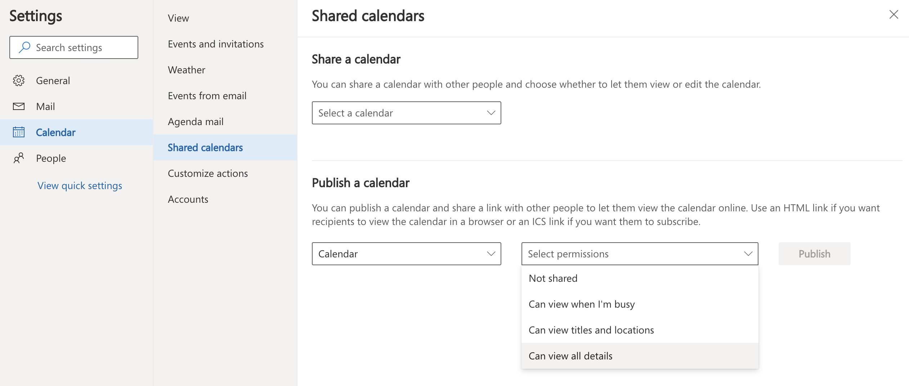
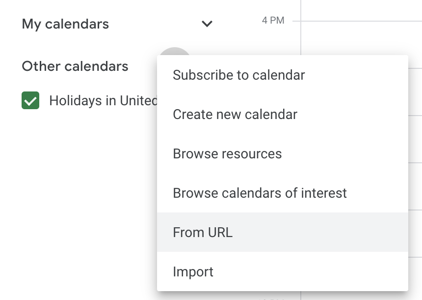

# Integrating your Outlook calendar into your Google calendar

## In Outlook
1. In your o365 Outlook, open the online shared calendar:
  * Go to this link: https://outlook.office.com/mail/options/calendar/SharedCalendars
  * Or open Settings -> View Outlook Settings -> Calendar -> Shared Calendars

2. Under Publish a Calendar, select your primary calendar
3. Select your desired view permission level
4. Click publish
5. Copy the ICS calendar link

## In Gmail
1. Open your Google calendar
2. Click on Other Calendars -> Add -> From URL
 

3. Paste the ICS link and then click on Add Calendar
4. Refresh the calendar page
5. Optional: click on calendar options (elipsis next to the calendar name) 
  * Choose the calendar color
  * Click on Settings and rename the calendar
